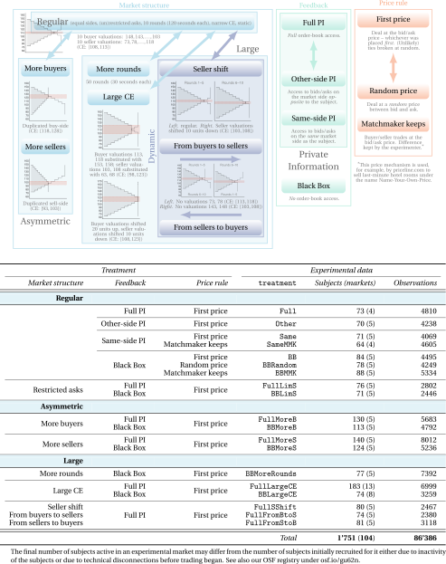

# Trading in a Black Box

<p align="center">
  
</p>

For further details about the experiments and a summary of the results, please refer to [[1]](#1) and [[2]](#2).

## References
<a id="1">[1]</a> 
B. Ikica, S. Jantschgi, H. H. Nax, D. G. Nuñez‐Duran, B. S. R. Pradelski, _Competitive Market Behavior: Convergence and Asymmetry in the Experimental Double Auction_. _To appear in Int. Econ. Rev., available [here](https://doi.org/10.1111/iere.12630) ([full text](http://dx.doi.org/10.2139/ssrn.3131004))._\
<a id="2">[2]</a>
_Competitive market behavior: a large-scale replication and robustness check of the experimental continuous double auction a la V Smith '62, [OSF](https://osf.io/gu62n/)._

The figure above was prepared with the [```LaTeX```](https://www.latex-project.org/) drawing package [```PGF/TikZ```](https://github.com/pgf-tikz/pgf) and [```Python```](https://www.python.org/) visualisation libraries [```Matplotlib```](https://matplotlib.org/) and [```Seaborn```](https://seaborn.pydata.org/).
