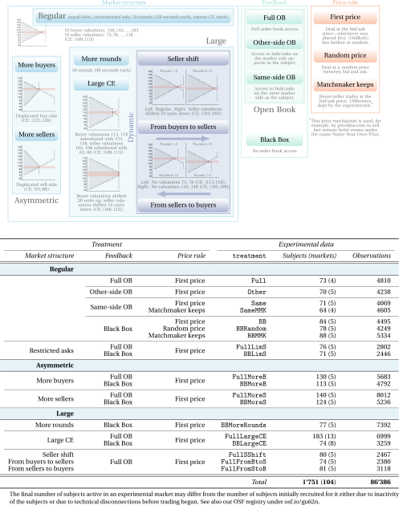

# Trading in a Black Box

<p align="center">
  
</p>

For further details about the experiments and a summary of the results, please refer to [[1]](#1) and [[2]](#2).

## References
<a id="1">[1]</a> 
B. Ikica, S. Jantschgi, H. H. Nax, D. G. Nuñez‐Duran, B. S. R. Pradelski, _Trading in a Black Box: Zero Intelligence \& Lack of Knowledge_. _Submitted, available [here](http://dx.doi.org/10.2139/ssrn.3131004)._\
<a id="2">[2]</a>
_Feedback effects in the experimental double auction with private information, [OSF](https://osf.io/gu62n/)._

The figure above was prepared with the [```LaTeX```](https://www.latex-project.org/) drawing package [```PGF/TikZ```](https://github.com/pgf-tikz/pgf) and [```Python```](https://www.python.org/) visualisation libraries [```Matplotlib```](https://matplotlib.org/) and [```Seaborn```](https://seaborn.pydata.org/).
